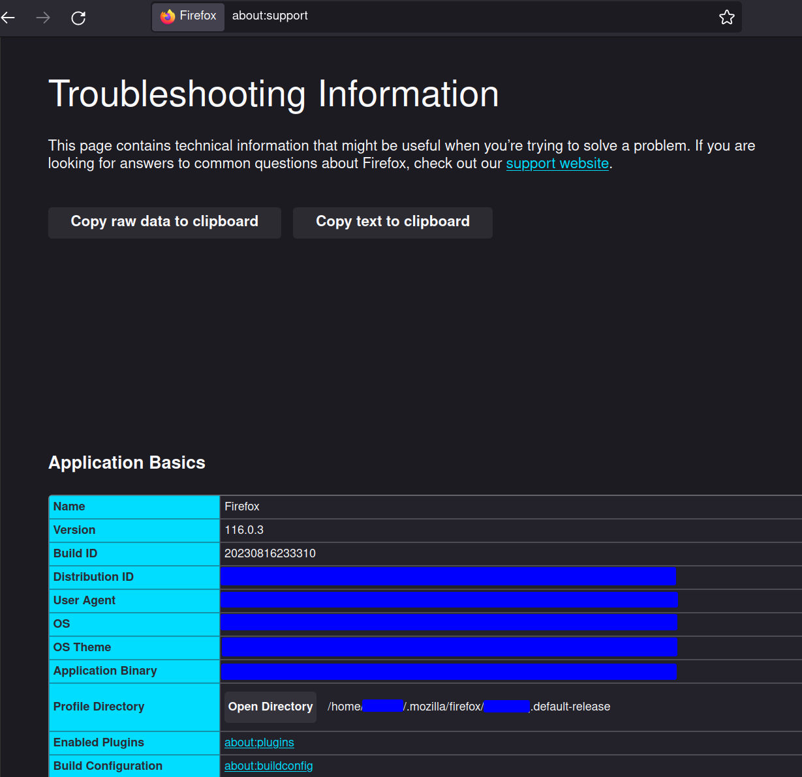

> # 2024 Update:
>
> Firefox now have support for vertical tabs built in, and I recommend using it instead of Sidebery:
>
> __NB:__ It is worth noting that these will not auto-hide, you have to press the "Expand sidebar"-button at the top left manually.
>
> 1. Open `about:config`
> 2. "Accept the Risk and Continue"
> 3. Enable `siebar.verticalTabs`

# Firefox Styling with Auto-hiding Vertical Tabs

Firefox can look old-school, but with some extra add-ons and styling it can get a fresh look with auto-hiding vertical-tabs:

The following steps will:

- Hide the horizontal tabs
- Hide the title bar
- Enable vertical tabs
  - (using Sidebery for Tree Style Tabs)
- Enable autohiding of vertical tabs

## Steps:

### 1. Install Sidebery

**NB:** At the time of writing, the following modifications require beta-version `5.0.0b31`, which must be downloaded and installed from the [GitHub releases page](https://github.com/mbnuqw/sidebery/releases).

<!-- Install the [Sidebery add-on](https://addons.mozilla.org/en-US/firefox/addon/sidebery/). -->

### 2. Open the Profile Directory

Open the URL `about:support` in Firefox, locate `Profile Directory` and press the *Open Directory*-button.

### 3. Add Firefox-styling

If necessary create a folder named `chrome`, and then inside it a file called `userChrome.css`.

Modify the `chrome/userChrome.css`-file with the attached [userChrome.css](resources/2023-08-22_firefox-userchrome.css).

### 4. Enable legacy stylesheets

Open the URL `about:config` in Firefox and enable `toolkit.legacyUserProfileCustomizations.stylesheets`.

### 5. Style Sidebery

Open the Sidebery settings by pressing the cogwheel-icon in the upper right corner of Sidebery and navigate to the `Styles editor`.

Paste the content of the [SideberyStyles.css](resources/2023-08-22_firefox-sidebery-styles.css) into the editor (on the right side of the page).

### 6. Hide title-bar

Right click the toolbar and press *Customize Toolbar...*. At the bottom-left side of the page uncheck `Title Bar` and press the *Done*-button.

### 7. Restart Firefox

Restart Firefox to reload the `userChrome.css`-file.

### 8. Fix styling error of pinned tabs

At the time of writing pinned tabs are rendered with weird icon-spacing in Sidebery.
To counteract this behaviour, you can enable showing titles for pinned tabs, making them render vertically instead of horizontal (personally I find it preferable anyway).

Open Sidebery settings and under `Settings > Tabs > Pinned tabs` enable _Show titles of pinned tabs_.
